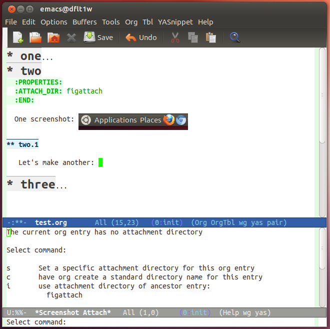

<h2>Table of Contents</h2>

<ul>
<li><a href="#sec-1">1. Overview</a></li>
<li><a href="#sec-2">2. Installation</a></li>
<li><a href="#sec-3">3. Motivation</a></li>
</ul>

# Overview

Org-screenshot allows taking screenshots from within an emacs org
buffer session.

Features:

-   The link to the image file will be placed at *point*

-   *org inline images* will be turned on to display it.

-   Screenshots are placed into the org entry's attachment
    directory.

-   If no attachment directory has been defined, the user will be
    offered choices for creating one or using a directory of an entry
    higher up in the hierarchy.

-   The emacs frame from which the command is issued will hide away
    during the screenshot taking, except if a prefix argument has been
    given (so to allow taking images of the emacs session itself).
    
    

# Installation

Put org-screenshot.el into your load-path and the following into
your `~/.emacs`:

    (require 'org-screenshot)

The library requires the **import** command from the ImageMagick suite to
be installed on your machine.

# Motivation

Org with its Babel functionality is a great tool for producing technical
documentation. One can directly use code snippets to produce graphics and
have them rendered into the document. So, it is great for writing a manual
about an application which produces graphics output.

While working on my manual, I several times had to take screenshots in order
to illustrate how to interact with the program. I thought it would
be fantastic to have this functionality integrated with org attachments, since
this provides a means to associate the figure files with org entries, and
not having to copy files around or enter the path information again and again.
Also, I wanted to immediately see the results in my org buffer.

I think that org-screenshot will also be useful for users of
the more agenda related strengths of org mode.

BTW: There is another nice generic screenshot library available for
emacs ([screenshot.el by rubikitch](http://www.emacswiki.org/emacs/screenshot.el)) with some great features, but
different focus (more generic, allows uploads of screenshots to
remote servers and offers multiple predefined storage targets). I used
it at first as a dependency of this module, but since I essentially ended up only
using the wrapper function for the ImageMagick import command, I decided
to rather make it independent instead of forcing users to install both.
I wanted to have an especially well integrated screenshot feature to
match the org workflow.
